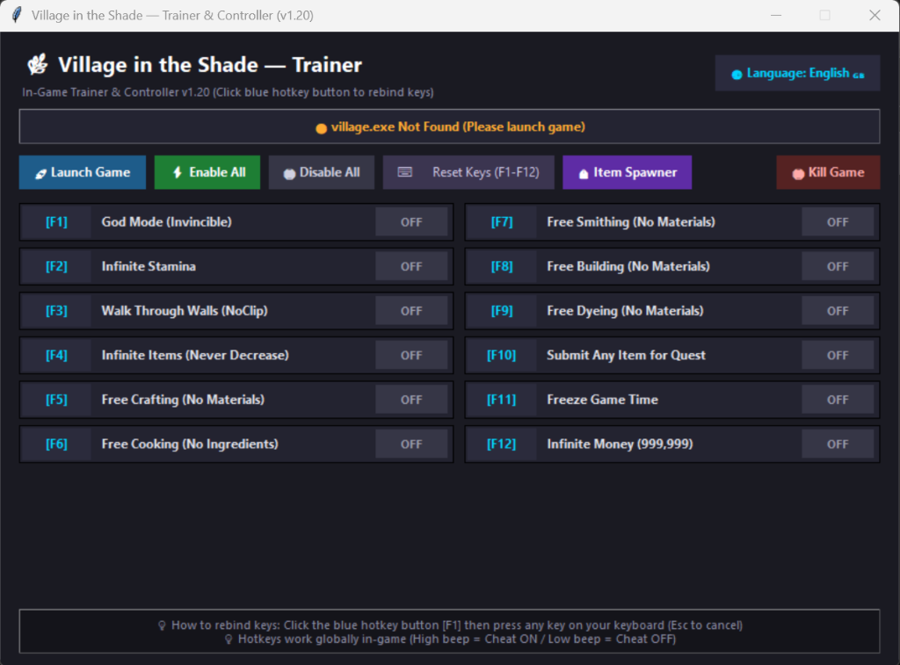
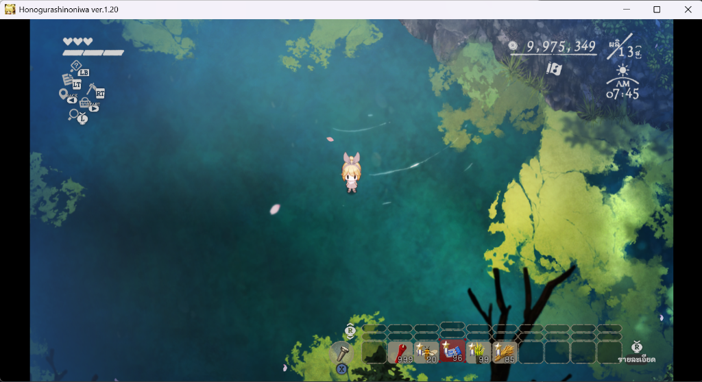
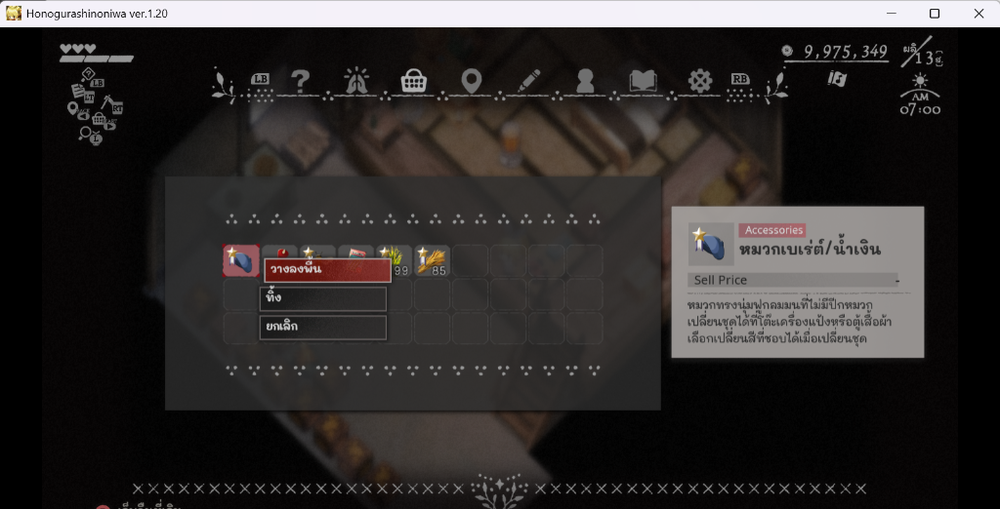
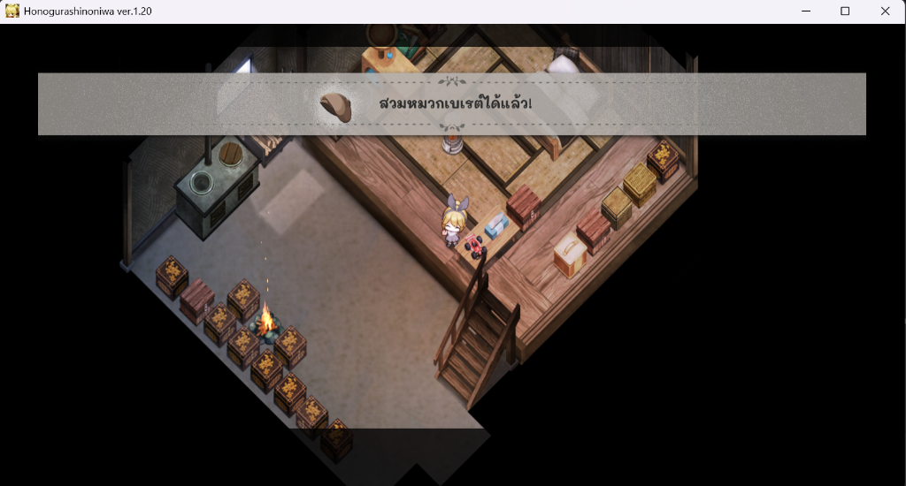

# Village in the Shade — Trainer & Item Spawner (v1.20)

🌿 โปรแกรมโกงเกมและแผงเสกไอเทมสำหรับ **Village in the Shade (静谧田园)** เวอร์ชัน 1.20  
รองรับเมนู 2 ภาษา (**ไทย 🇹🇭 / English 🇬🇧**) พร้อมระบบปรับแต่งปุ่มลัดอิสระและแผงค้นหาไอเทมมากกว่า 2,850 ชิ้น

---

## 📸 ภาพตัวอย่างการใช้งาน (Screenshots)

### 🖥️ หน้าต่างโปรแกรม (Trainer & Controller GUI)


### 🎮 ตัวอย่างการใช้งานในเกม (In-Game Gameplay)


### 🎒 ขั้นตอนสำคัญหลังเสก: ทิ้งไอเทมลงพื้นและเก็บขึ้นมาใหม่ (Drop & Pick up Item to Unlock)
| 1. เลือกไอเทมในกระเป๋าแล้วกด **"วางลงพื้น"** | 2. เดินเก็บขึ้นมา ระบบจะตรวจจับและปลดล็อคทันที |
| :---: | :---: |
|  |  |

หากทิ้งและของหายให้ ไปนอนและออกเกมและเปิดมาและทิ้งอีกทีจะหายบั๊ก

## ✨ ฟีเจอร์หลัก (Features)

### 1. ⚡ 12 สูตรโกงหลักในเกม (Core In-Game Cheats)
| ปุ่มเริ่มต้น | สูตรภาษาไทย | English Feature | รายละเอียด |
| :---: | :--- | :--- | :--- |
| **F1** | อมตะ / เลือดไม่ลด | God Mode (Invincible) | เลือดไม่ลดจากการโจมตีหรือกับดัก |
| **F2** | สตามิน่าเต็มตลอด | Infinite Stamina | วิ่งและทำงานได้ไม่จำกัดค่าเหนื่อย |
| **F3** | เดินทะลุกำแพง | Walk Through Walls (NoClip) | เดินทะลุสิ่งกีดขวาง ต้นไม้ และกำแพง |
| **F4** | ไอเทมไม่ลด | Items Won't Decrease | ใช้ของ โยนของ ปลูกพืช ไอเทมไม่ลด |
| **F5** | คราฟต์ของ ฟรี | Free Crafting | สร้างสิ่งของได้โดยไม่ต้องใช้วัตถุดิบ |
| **F6** | ทำอาหาร ฟรี | Free Cooking | ปรุงอาหารได้โดยไม่ต้องมีวัตถุดิบ |
| **F7** | ตีเหล็ก ฟรี | Free Smithing | อัปเกรดและตีเหล็กฟรี |
| **F8** | ก่อสร้าง ฟรี | Free Building | สร้างสิ่งปลูกสร้างฟรี |
| **F9** | ย้อมสี ฟรี | Free Dyeing | ย้อมสีอุปกรณ์ได้ฟรี |
| **F10** | ส่งเควสต์ได้ทุกไอเทม | Submit Any Item | ส่งเควสต์ผ่านได้ด้วยไอเทมใดๆ |
| **F11** | หยุดเวลาในเกม | Freeze Game Time | ล็อคเวลาไม่ให้เดินหน้า |
| **F12** | เงินไม่จำกัด (999,999) | Infinite Money | ล็อคเงินเป็น 999,999 ตลอดเวลา |

---

### 2. 🎒 แผงเสกไอเทมเต็มระบบ (Item Spawner / Adder)
* คลังไอเทม **2,855 ชิ้น** (โหลดจากฐานข้อมูล `items_th.json`)
* แยกหมวดหมู่ชัดเจน: พืชผล, เมล็ดพันธุ์, แร่, สัตว์, ปลา, อาหาร, เครื่องมือ, เสื้อผ้า, เฟอร์นิเจอร์, พิมพ์เขียว, ของเควสต์
* ค้นหาได้รวดเร็วทั้ง **ชื่อไทย, English, หรือรหัส ID**
* **โหมดการเสก:**
  * ✋ **เสกทับของในมือ (In-Hand):** ถือของอะไรก็ได้ 1 ชิ้นในมือ แล้วกดเสก จะเปลี่ยนเป็นไอเทมที่เลือกทันทีในเกมสดๆ
  * 🎒 **เสกทับช่องกระเป๋า (Slot 00-29):** เลือกช่องแล้วกดเสกทับไอเทมในช่องนั้น
 

> 💡 **ข้อสำคัญหลังเสกไอเทม (Important Step After Spawning):**  
> หลังจากกดเสกไอเทมเข้าตัวหรือเข้ามือเรียบร้อยแล้ว **ต้องกดทิ้งไอเทมลงพื้น ("วางลงพื้น" หรือ "ทิ้ง") แล้วเดินเก็บขึ้นมาใหม่ 1 ครั้ง**  
> เพื่อให้ระบบเกมตรวจจับ trigger การได้รับไอเทม ปลดล็อคระบบ หรือนำไปสวมใส่/ใช้งานได้อย่างสมบูรณ์!

---

### 3. 🌐 รองรับ 2 ภาษา (Bilingual Support)
* กดปุ่มสลับภาษา `[ 🌐 ภาษา: ไทย 🇹🇭 ]` / `[ 🌐 Language: English 🇬🇧 ]` ที่มุมขวาบนได้ทันที
* บันทึกภาษาที่เลือกและปุ่มลัดที่ตั้งค่าไว้ลงใน `trainer_config.json` อัตโนมัติ

---

### 4. ⏱️ โหมดสโลว์โมชั่น (Slow Motion / Speedhack)
* ลดความเร็วเกมสำหรับมินิเกมที่กดไม่ทัน เช่น **มินิเกมเป่านกหวีดแห่งปาฏิหาริย์ (Whistle of Miracles)**
* มีตาราง `SlowMotion_Speedhack.CT` และ `Village in the Shade1.20.CT` ในโปรเจกต์
* เลือกระดับความเร็วได้: **0.3x** (ช้าลง 3 เท่า - แนะนำ), **0.2x** (ช้าลง 5 เท่า), **0.5x** (ช้าลง 2 เท่า)
* กดปุ่มลัด **`Num -`** (ปุ่มลบแป้นตัวเลข) เพื่อเปิด/ปิดสโลว์โมชั่นได้ทันทีขณะเล่นเกม

---

## 🚀 วิธีติดตั้งและใช้งาน (How to Use)

### ข้อกำหนดระบบ (Requirements)
* Windows 10 / 11 (64-bit)
* Python 3.10 ขึ้นไป

### ขั้นตอนการใช้งาน
1. วางไฟล์ทั้งหมดไว้ในโฟลเดอร์เกมเดียวกับ `village.exe`  
   *(ปกติอยู่ที่ `...\Steam\steamapps\common\Village in the Shade`)*
2. เปิดเกมตามปกติและโหลดเซฟเดินในเกม
3. ดับเบิ้ลคลิกไฟล์ `run_trainer.bat` หรือเปิดผ่าน Terminal:
   ```powershell
   python trainer.py
   ```
4. กดเปิดสูตรโกงหรือคลิก **[ 🎒 แผงเสกไอเทม / Item Spawner ]** ได้ทันที!
5. **หลังกดเสกของ:** กดเปิดกระเป๋าในเกม เลือกไอเทมนั้นแล้วกด **"วางลงพื้น"** จากนั้นเดินเก็บขึ้นมาใหม่ 1 ครั้งเพื่อปลดล็อคใช้งาน

---

### ⏱️ วิธีใช้งานโหมดสโลว์โมชั่น (How to Use Slow Motion)
เหมาะเป็นพิเศษสำหรับช่วงที่เจอมินิเกมที่ความเร็วสูงหรือจังหวะเร็วเกินไปจนกดไม่ทัน เช่น **มินิเกมเป่านกหวีดแห่งปาฏิหาริย์ (Whistle of Miracles)**:

#### วิธีที่ 1: กดจากปุ่มบนตัว Trainer (แนะนำ — สะดวกที่สุด)
1. บนหน้าต่าง Trainer ให้คลิกที่ปุ่มสีส้มน้ำตาล **`[ ⏱️ สโลว์โมชั่น ]`** *(อยู่ข้างปุ่มสีม่วง `[ 🎒 แผงเสกไอเทม ]`)*
2. ตัวโปรแกรมจะเรียกตาราง Cheat Engine ขึ้นมา และ **เปิดระบบสโลว์ 0.3x (ช้าลง 3 เท่า) ให้อัตโนมัติทันที** โดยไม่ต้องคลิกตั้งค่าเอง
3. **สลับกลับเข้าหน้าจอเกม:** แถบจังหวะเพลงและแอนิเมชันจะวิ่งช้าลงอย่างเห็นได้ชัด ทำให้มองและกดปุ่ม LB / RB ตามจังหวะได้ทันสบายๆ 100%
4. **เมื่อเป่าผ่านเควสต์แล้ว:** กดปุ่ม **`Num -`** (ปุ่มเครื่องหมายลบ บนแป้นตัวเลขขวามือ) หรือปิดหน้าต่างตารางสโลว์โมชั่น เกมจะกลับมาเร็วปกติ 1.0x ทันทีครับ

#### วิธีที่ 2: ดับเบิ้ลคลิกไฟล์ `SlowMotion_Speedhack.CT`
1. ดับเบิ้ลคลิกเปิดไฟล์ `SlowMotion_Speedhack.CT` ในโฟลเดอร์เกม หรือที่หน้า Desktop
2. ระบบจะเชื่อมต่อกับตัวเกม `village.exe` และเปิดใช้งานสปีด 0.3x ให้อัตโนมัติ
3. สามารถกดปุ่ม **`Num -`** เพื่อสลับเปิด/ปิดสโลว์โมชั่นได้ตลอดเวลาขณะเล่นเกมโดยไม่ต้องสลับหน้าจอ

---

## ⌨️ วิธีแก้ไขปุ่มลัด (Custom Hotkeys)
* คลิกที่ปุ่มสีฟ้าของสูตรที่ต้องการ เช่น `[F1]`
* กดปุ่มใหม่บนคีย์บอร์ดที่ต้องการใช้
* ปุ่มจะเปลี่ยนและบันทึกการตั้งค่าให้อัตโนมัติ (กด `Esc` เพื่อยกเลิก)

---

## ⚠️ คำเตือน (Disclaimer)
โปรแกรมนี้สร้างขึ้นเพื่อความบันเทิงและการทดสอบเท่านั้น กรุณาสำรองไฟล์เซฟเกมก่อนใช้งาน
